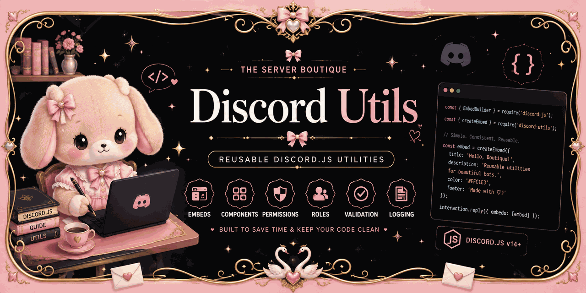

<p align="center">
  
</p>

# 🌸 Discord Utils

A collection of reusable utilities for **Discord.js v14** built and maintained by **The Server Boutique**.

Designed to help developers build cleaner, more maintainable Discord bots with reusable components and helper functions.

---

## ✨ Features

- 📦 Reusable embed builders
- 🔘 Button utilities
- 📋 Select menu helpers
- 📝 Modal utilities
- 🔐 Permission helpers
- 👥 Role utilities
- 🎨 Formatting helpers
- ✅ Validation utilities
- 📖 Well documented
- 🧪 Built with testing in mind

---

## 📂 Project Structure

```text
discord-utils/
│
├── src/
│   ├── buttons/
│   ├── embeds/
│   ├── formatting/
│   ├── logging/
│   ├── modals/
│   ├── permissions/
│   ├── roles/
│   ├── select-menus/
│   ├── validation/
│   └── index.js
│
├── tests/
├── package.json
├── README.md
└── LICENSE
```

---

## 📦 Installation

```bash
npm install
```

*(Publishing to npm is planned for a future release.)*

---

## 🚀 Basic Usage

```javascript
const {
    createSuccessEmbed,
    createErrorEmbed
} = require("@theserverboutique/discord-utils");

const successEmbed = createSuccessEmbed(
    "Success",
    "Everything worked!"
);

const errorEmbed = createErrorEmbed(
    "Error",
    "Something went wrong."
);
```

---

## 📚 Available Modules

| Module | Description |
|---------|-------------|
| Embeds | Create consistent Discord embeds |
| Buttons | Build reusable Discord buttons |
| Select Menus | Generate dropdown menus |
| Modals | Build Discord modal forms |
| Permissions | Permission checking helpers |
| Roles | Role management helpers |
| Formatting | Common formatting functions |
| Validation | Input validation helpers |
| Logging | Structured logging utilities |

---

## 🎯 Project Goals

- Build production-ready Discord.js utilities.
- Keep APIs simple and consistent.
- Encourage clean, maintainable code.
- Share reusable components with the community.

---

## 🗺️ Roadmap

### Version 1.0
- ✅ Embed utilities
- ✅ Button utilities
- ✅ Select menu utilities
- ✅ Modal utilities
- ✅ Permission helpers
- ✅ Role helpers
- ✅ Formatting helpers
- ✅ Validation helpers
- ✅ Logging helpers

### Planned

- Component pagination
- Embed pagination
- Better error handling
- TypeScript support
- Full documentation website
- npm package release

---

## 🤝 Contributing

Contributions, suggestions and bug reports are welcome.

If you have an idea for a new utility or improvement, feel free to open an issue or submit a pull request.

---

## 📄 Licence

Released under the **MIT License**.

---

## 🌸 About The Server Boutique

The Server Boutique creates custom Discord bots, server design, community automation and reusable developer tools.

If this project helps you, consider supporting future development by visiting our Ko-fi page.

☕ https://ko-fi.com/theserverboutique
